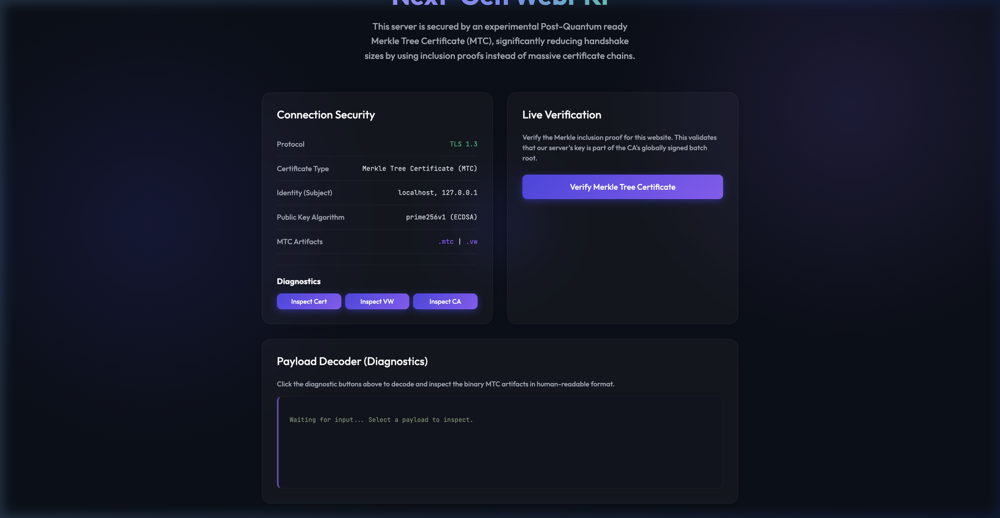
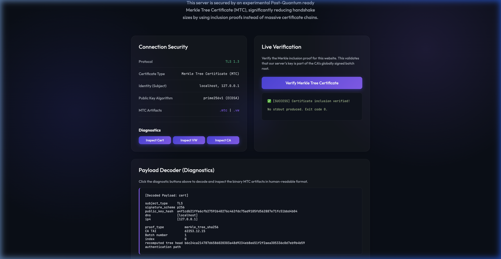
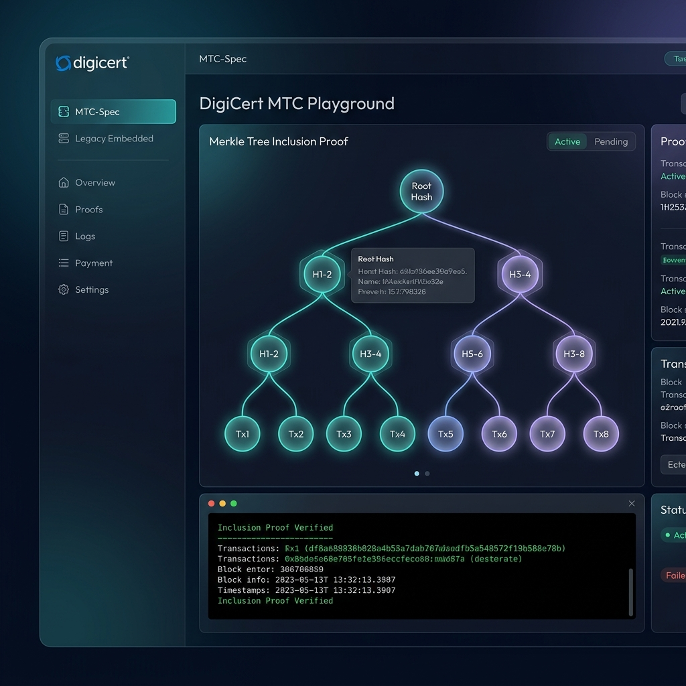

# Merkle Tree Certificates (MTC) Demonstration

[](#)
[](#)
[](#)
[](#)
[](#)

This project provides a fully self-contained, automated demonstration of **Merkle Tree Certificates (MTC)**—an experimental Internet Engineering Task Force (IETF) architectural proposal designed to fix the severe performance bottlenecks caused by massive Post-Quantum Cryptography (PQC) signature sizes in standard TLS handshakes.



## What are Merkle Tree Certificates?

As the web transitions to quantum-resistant algorithms, standard certificates equipped with PQC signatures (like ML-DSA) balloon in size. This massive data overhead leads to TLS handshake fragmentation, high latency, and severe middlebox compatibility issues.

Instead of bundling multiple massive signatures inside every certificate, MTCs introduce an elegant solution:
1. **Batch Signing:** A Certificate Authority (CA) aggregates hundreds of certificates into a Merkle tree and signs only the root hash.
2. **Inclusion Proofs:** Servers simply transmit a compact Merkle authentication path (an inclusion proof) to prove they are part of the CA's signed tree.
3. **Validity Windows:** Clients verify the proofs against trusted checkpoints (signed validity windows) fetched out-of-band.

The result? The internet gets quantum-level security without sacrificing the speed of modern TLS.

## Features

* **Automated PKI Generation:** Spin up a local Merkle Tree CA using Cloudflare's reference implementation in a single command.
* **Certificate Issuance Simulation:** Automates the queueing and batch issuance of assertions into valid MTC artifacts (`.mtc`, `.vw`, and `ca-params`).
* **TLS 1.3 Web Server:** A Go-based backend that enforces TLS 1.3 and statically exposes the generated MTC artifacts in a `/.well-known/mtc/` style structure.
* **Live In-Browser Verification:** Real-time backend verification of the certificate's inclusion proof, mimicking an interoperable TLS client.
* **Payload Decoder & Diagnostics:** Explore the internals of the experimental binary structures (CA Params, Validity Window, Certificate payload) right from the browser.
* **Secure Containerization:** Containerized using an ultra-hardened, zero-CVE Chainguard distroless base image for the absolute minimum attack surface.
* **Multi-Arch CI Pipeline:** Fully automated GitHub Actions workflow to build the secure container concurrently across `linux/amd64` and `linux/arm64` via QEMU and Buildx.



## Running with Docker Compose (Recommended)

The easiest way to run the entire demonstration is using **Docker Compose**, which orchestrates two separate containers:
1. **`mtc-demo-website`**: The main MTC demonstration UI (Port 8443).
2. **`mtc-playground`**: The interactive DigiCert MTC Playground dashboard (Port 8444).

```bash
# Build and start both services
docker compose up --build -d
```

Once the containers are healthy, open your browser to:
* **MTC Demo Website (HTTPS):** `https://localhost:8443`
* **DigiCert MTC Playground (HTTPS):** `https://localhost:8444`

To view logs:
```bash
docker compose logs -f
```

## DigiCert MTC Playground

In addition to the main demo, we have integrated the **DigiCert MTC Playground** dashboard. This interface provides an interactive environment to generate and verify MTC certificates in two distinct modes:

1. **MTC-Spec (Primary):** Implements the `id-alg-mtcProof` signature algorithm, where the inclusion proof is carried directly in the `signatureValue` field.
2. **Legacy Embedded (Compatibility):** Embeds the MTC inclusion proof as a non-critical X.509 extension for backward compatibility with existing systems.




## Quick Start

### 1. Requirements
* `go` (1.21+)
* `openssl`
* macOS or Linux environment

### 2. Setup the PKI & Generate Payloads
Navigate into the `demo` directory and run the fully automated setup script. This will compile the CLI, initialize the CA, issue a batch containing our `localhost` certificate, and extract the generated payloads.

```bash
chmod +x setup.sh
./setup.sh
```

During setup, you will see a dump of the decoded diagnostic structures printed directly to your terminal.

### 3. Launch the Demo Web Server
Start the Go web server to serve the beautiful UI and diagnostic APIs.

```bash
go run main.go
```

The server will bind to `8443` enforcing **TLS 1.3**.

### 4. Explore the Interface
Open your browser and navigate to:
**`https://localhost:8443`**

*(Note: You will receive a standard browser security warning because the server uses a self-signed X.509 certificate as a fallback, given that mainstream browsers do not natively support MTCs in the handshake just yet. Click `Advanced -> Proceed to localhost`.)*

Once loaded, click **"Verify Merkle Tree Certificate"** to perform a live inclusion proof verification, and use the **Diagnostics Buttons** to decode the various binary payloads.

## Project Structure

```text
/
├── docker-compose.yml   # Multi-container orchestration
├── Dockerfile           # Secure multi-stage build with multiple runtime targets
├── .github/workflows/   # Multi-arch CI pipeline via QEMU/Buildx
├── demo/                # Main MTC Demonstration
│   ├── setup.sh         # Automates CA creation and certificate issuance
│   ├── main.go          # The Go TLS 1.3 Web Server and verification API
│   └── static/          # Premium frontend UI
└── playground/          # DigiCert MTC Playground
    ├── main.go          # Playground API wrapper
    └── static/          # Playground dashboard UI
```

## Behind the Scenes (How Verification Works)
When you click the "Verify" button on the UI, the Go backend executes the reference verification logic:
```bash
mtc-cli verify -ca-params <ca-params> -validity-window <website.vw> <website.mtc>
```
If the certificate's authentication path successfully hashes up to the tree head checkpoint listed in the validity window, the certificate is implicitly trusted without requiring its own bulky PQC signature!
