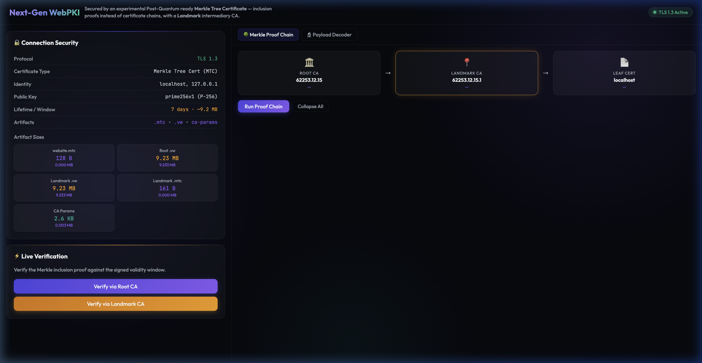
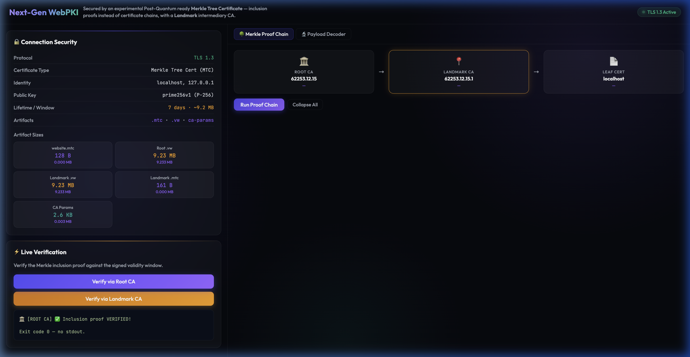
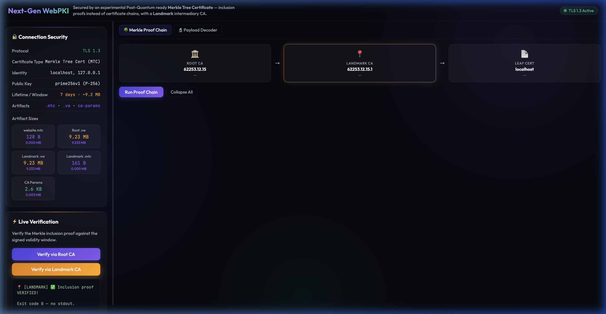
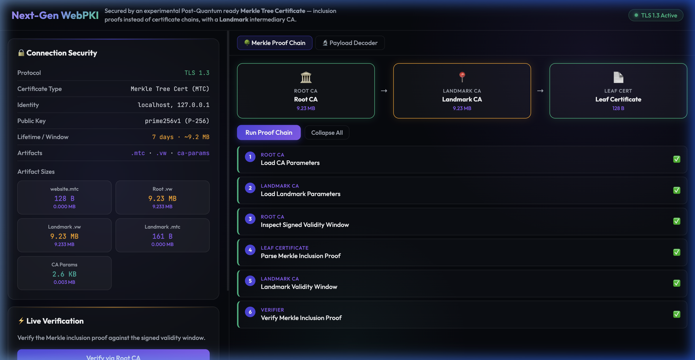
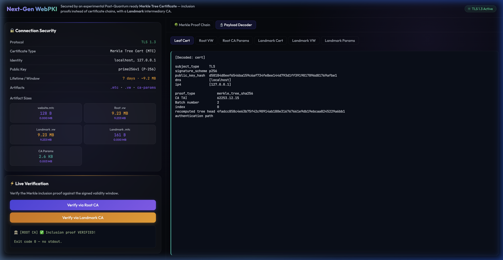
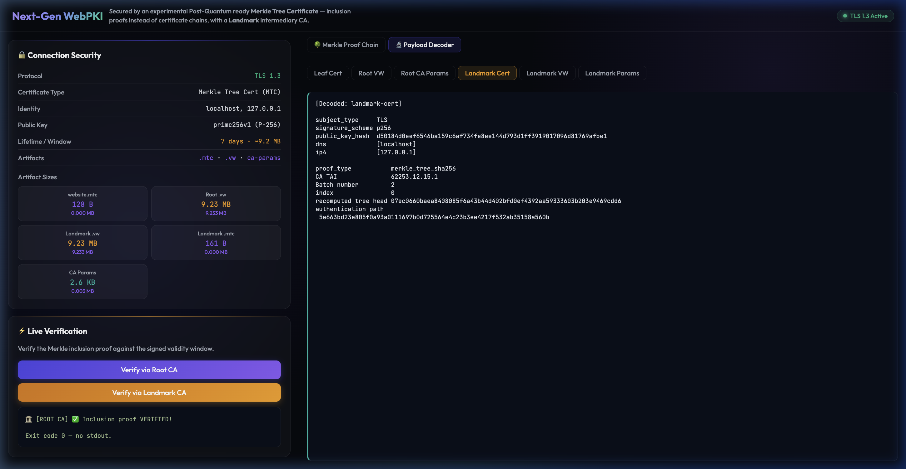
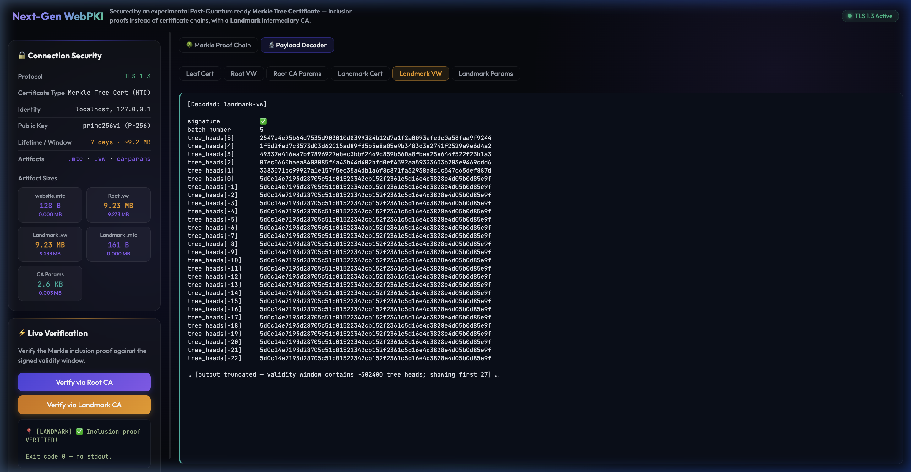
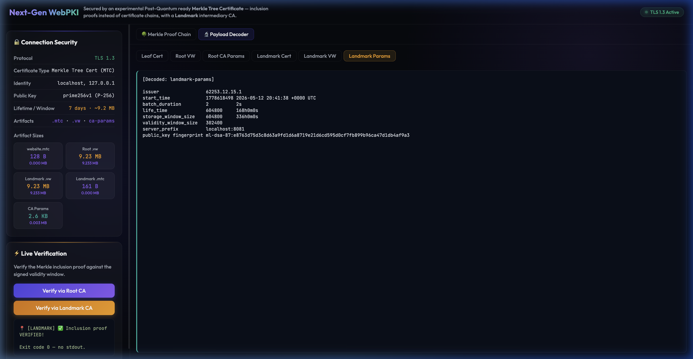

# Merkle Tree Certificates (MTC) Demonstration

[](#)
[](#)
[](#)
[](#)
[](#)

This project provides a fully self-contained, automated demonstration of **Merkle Tree Certificates (MTC)**—an experimental IETF architectural proposal designed to fix the severe performance bottlenecks caused by massive Post-Quantum Cryptography (PQC) signature sizes in standard TLS handshakes.

## Live UI

The demo runs as a single-screen landscape application at `https://localhost:8443`.


*Left panel: live connection info and artifact sizes. Right panel: tabbed Merkle Proof Chain and Payload Decoder.*

---

## What are Merkle Tree Certificates?

As the web transitions to quantum-resistant algorithms, standard certificates with PQC signatures (like ML-DSA) balloon in size, leading to TLS handshake fragmentation and high latency.

Instead of bundling multiple massive signatures inside every certificate, MTCs introduce an elegant solution:
1. **Batch Signing:** A CA aggregates hundreds of certificates into a Merkle tree and signs only the root hash.
2. **Inclusion Proofs:** Servers transmit a compact Merkle authentication path proving they are part of the CA's signed tree.
3. **Validity Windows:** Clients verify proofs against trusted checkpoints (signed validity windows) fetched out-of-band.

The result: quantum-level security without sacrificing the speed of modern TLS.

---

## Features

- **Automated PKI Generation** — Spins up a full Merkle Tree CA hierarchy (Root CA + Landmark intermediary CA) in a single command.
- **Dual CA Trust Chain** — Demonstrates a Root CA → Landmark CA → Leaf Certificate chain with independent validity windows.
- **TLS 1.3 Web Server** — Go backend that enforces TLS 1.3-only.
- **Live Inclusion Proof Verification** — Backend calls `mtc-cli verify` in real time and returns pass/fail.
- **Merkle Proof Chain Visualizer** — Step-by-step walkthrough of the 6-stage trust chain verification.
- **Payload Decoder** — Decode the raw binary CA Params, Validity Window, and Certificate structures right in the browser.
- **Secure Containerization** — Zero-CVE Chainguard distroless runtime image.
- **Multi-Arch CI/CD** — GitHub Actions builds for both `linux/amd64` and `linux/arm64`.

---

## Screenshots

### Root CA Verification

*Clicking "Verify via Root CA" triggers a live backend `mtc-cli verify` call. The inclusion proof is validated against the Root CA's signed validity window.*

### Landmark CA Verification

*The Landmark intermediary CA independently verifies the same certificate via its own validity window.*

### Merkle Proof Chain — All 6 Steps Passed

*The Proof Chain tab walks through all six trust-chain steps: CA Parameters → Landmark Parameters → Signed Validity Windows → Inclusion Proof → Full Verification. All ✅.*

### Payload Decoder — Decoded Structures

*The Payload Decoder tab decodes the binary certificate, validity windows, and CA parameters into human-readable output.*

### Landmark Certificate

*Decodes the certificate issued via the Landmark CA path (`landmark-website.mtc`).*

### Landmark Validity Window (Truncated)

*Validity window preview — the full window contains ~302,400 tree heads (9.23 MB); the display shows the first 30 lines to keep the browser responsive.*

### Landmark CA Parameters

*CA parameters for the Landmark intermediary CA, showing batch duration, lifetime, and storage duration.*

---

## Running with Docker (Recommended)

```bash
# Build the multi-arch image locally
docker build -t mtc-demo:latest .

# Run the container mapping the secure port
docker run -p 8443:8443 mtc-demo:latest
```
Then open `https://localhost:8443` in your browser.

---

## Quick Start (Local)

### 1. Requirements
- `go` (1.21+)
- `openssl`
- macOS or Linux

### 2. Setup the PKI & Generate Payloads

```bash
cd demo
chmod +x setup.sh
./setup.sh
```

This initialises both the Root CA and Landmark CA, issues batches, and extracts all MTC artifacts.

### 3. Launch the Demo Web Server

```bash
cd demo
./website-server
# or: go run main.go
```

The server binds to `:8443` enforcing **TLS 1.3** only.

### 4. Explore the Interface
Open **`https://localhost:8443`** and accept the self-signed certificate warning (`Advanced → Proceed to localhost`).

- **Left panel:** Connection metadata and artifact sizes. Click either Verify button for a live inclusion proof check.
- **Right panel → Merkle Proof Chain tab:** Click *Run Proof Chain* to watch all 6 trust-chain steps execute and expand.
- **Right panel → Payload Decoder tab:** Select any tab (Leaf Cert, Root VW, CA Params, Landmark Cert, Landmark VW, Landmark Params) to decode the binary structures.

---

## Project Structure

```text
/
├── Dockerfile                # Secure multi-stage Chainguard container
├── entrypoint.sh             # Container entrypoint (runs setup.sh then website-server)
├── .github/workflows/        # Multi-arch CI pipeline
└── demo/
    ├── setup.sh              # Automates CA creation and certificate issuance
    ├── main.go               # Go TLS 1.3 web server + verification/inspect APIs
    ├── static/index.html     # Single-page landscape UI
    ├── screenshots/          # Live screencaptures (this document)
    ├── website-server        # Pre-built binary (arm64/amd64)
    ├── mtc-cli               # Pre-built MTC CLI binary
    ├── website.mtc           # Leaf certificate (Merkle inclusion proof)
    ├── website.vw            # Root CA signed validity window (~9.2 MB)
    ├── landmark.vw           # Landmark CA signed validity window (~9.2 MB)
    └── ca/ landmark-ca/      # CA state directories
```

---

## How Verification Works

When you click **Verify**, the Go backend runs:

```bash
mtc-cli verify \
  -ca-params ca/www/mtc/v04b/ca-params \
  -validity-window website.vw \
  website.mtc
```

If the certificate's authentication path successfully hashes up to the tree head checkpoint in the validity window, the certificate is trusted — **no bulky PQC signature required**.
